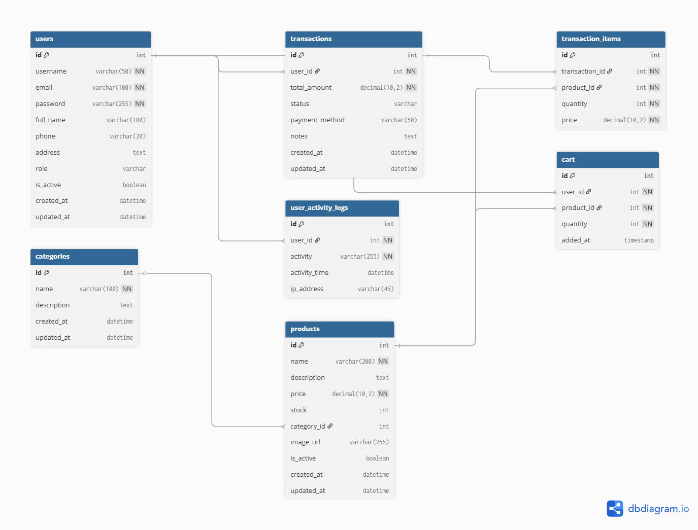

# Struktur Database

Dokumentasi ini menjelaskan struktur database untuk Sistem Manajemen Toko Online.

## ERD 

Berikut adalah diagram relasi antar tabel(ERD)


## Overview

Database menggunakan MySQL/MariaDB dengan skema relasional yang terdiri dari beberapa tabel utama dan tabel pendukung.

## Tabel Utama

### 1. users
Tabel untuk menyimpan data pengguna sistem.

```sql
CREATE TABLE users (
    id INT(11) PRIMARY KEY AUTO_INCREMENT,
    username VARCHAR(50) NOT NULL UNIQUE,
    email VARCHAR(100) NOT NULL UNIQUE,
    password VARCHAR(255) NOT NULL,
    role ENUM('admin', 'user') DEFAULT 'user',
    created_at DATETIME NOT NULL,
    updated_at DATETIME NOT NULL
);
```

**Kolom:**
- `id`: Primary key, auto increment
- `username`: Nama pengguna (unik)
- `email`: Email pengguna (unik)
- `password`: Password terenkripsi (hashed)
- `role`: Peran pengguna (admin/user)
- `created_at`: Tanggal pembuatan akun
- `updated_at`: Tanggal update terakhir

### 2. categories
Tabel untuk menyimpan kategori produk.

```sql
CREATE TABLE categories (
    id INT(11) PRIMARY KEY AUTO_INCREMENT,
    name VARCHAR(100) NOT NULL,
    description TEXT,
    created_at DATETIME DEFAULT CURRENT_TIMESTAMP,
    updated_at DATETIME DEFAULT CURRENT_TIMESTAMP ON UPDATE CURRENT_TIMESTAMP
);
```

**Kolom:**
- `id`: Primary key, auto increment
- `name`: Nama kategori
- `description`: Deskripsi kategori
- `created_at`: Tanggal pembuatan
- `updated_at`: Tanggal update terakhir

### 3. products
Tabel untuk menyimpan data produk.

```sql
CREATE TABLE products (
    id INT(11) PRIMARY KEY AUTO_INCREMENT,
    name VARCHAR(100) NOT NULL,
    description TEXT,
    price DECIMAL(10,2) NOT NULL,
    stock INT(11) NOT NULL DEFAULT 0,
    category_id INT(11),
    created_at DATETIME NOT NULL,
    updated_at DATETIME NOT NULL,
    FOREIGN KEY (category_id) REFERENCES categories(id) ON DELETE SET NULL
);
```

**Kolom:**
- `id`: Primary key, auto increment
- `name`: Nama produk
- `description`: Deskripsi produk
- `price`: Harga produk
- `stock`: Jumlah stok tersedia
- `category_id`: Foreign key ke tabel categories
- `created_at`: Tanggal pembuatan
- `updated_at`: Tanggal update terakhir

### 4. cart
Tabel untuk menyimpan keranjang belanja pengguna.

```sql
CREATE TABLE cart (
    id INT(11) PRIMARY KEY AUTO_INCREMENT,
    user_id INT(11) NOT NULL,
    product_id INT(11) NOT NULL,
    quantity INT(11) NOT NULL DEFAULT 1,
    added_at TIMESTAMP DEFAULT CURRENT_TIMESTAMP,
    FOREIGN KEY (user_id) REFERENCES users(id) ON DELETE CASCADE,
    FOREIGN KEY (product_id) REFERENCES products(id) ON DELETE CASCADE,
    UNIQUE KEY unique_user_product (user_id, product_id)
);
```

**Kolom:**
- `id`: Primary key, auto increment
- `user_id`: Foreign key ke tabel users
- `product_id`: Foreign key ke tabel products
- `quantity`: Jumlah produk dalam keranjang
- `added_at`: Tanggal produk ditambahkan ke keranjang

### 5. transactions
Tabel untuk menyimpan transaksi.

```sql
CREATE TABLE transactions (
    id INT(11) PRIMARY KEY AUTO_INCREMENT,
    user_id INT(11) NOT NULL,
    total_amount DECIMAL(10,2) NOT NULL,
    status ENUM('pending', 'completed', 'cancelled') DEFAULT 'pending',
    transaction_date DATETIME NOT NULL,
    FOREIGN KEY (user_id) REFERENCES users(id) ON DELETE CASCADE
);
```

**Kolom:**
- `id`: Primary key, auto increment
- `user_id`: Foreign key ke tabel users
- `total_amount`: Total nilai transaksi
- `status`: Status transaksi (pending/completed/cancelled)
- `transaction_date`: Tanggal transaksi

### 6. transaction_items
Tabel untuk menyimpan detail item dalam transaksi.

```sql
CREATE TABLE transaction_items (
    id INT(11) PRIMARY KEY AUTO_INCREMENT,
    transaction_id INT(11) NOT NULL,
    product_id INT(11) NOT NULL,
    quantity INT(11) NOT NULL,
    price DECIMAL(10,2) NOT NULL,
    FOREIGN KEY (transaction_id) REFERENCES transactions(id) ON DELETE CASCADE,
    FOREIGN KEY (product_id) REFERENCES products(id) ON DELETE CASCADE
);
```

**Kolom:**
- `id`: Primary key, auto increment
- `transaction_id`: Foreign key ke tabel transactions
- `product_id`: Foreign key ke tabel products
- `quantity`: Jumlah produk yang dibeli
- `price`: Harga produk saat transaksi

## Tabel Pendukung

### 7. user_activity_logs
Tabel untuk menyimpan log aktivitas pengguna.

```sql
CREATE TABLE user_activity_logs (
    id INT(11) PRIMARY KEY AUTO_INCREMENT,
    user_id INT(11) NOT NULL,
    activity TEXT NOT NULL,
    activity_time DATETIME NOT NULL,
    FOREIGN KEY (user_id) REFERENCES users(id) ON DELETE CASCADE
);
```

**Kolom:**
- `id`: Primary key, auto increment
- `user_id`: Foreign key ke tabel users
- `activity`: Deskripsi aktivitas
- `activity_time`: Waktu aktivitas

### 8. system_settings (Opsional)
Tabel untuk menyimpan pengaturan sistem.

```sql
CREATE TABLE system_settings (
    id INT(11) PRIMARY KEY AUTO_INCREMENT,
    setting_key VARCHAR(100) NOT NULL UNIQUE,
    setting_value TEXT,
    description TEXT,
    created_at DATETIME DEFAULT CURRENT_TIMESTAMP,
    updated_at DATETIME DEFAULT CURRENT_TIMESTAMP ON UPDATE CURRENT_TIMESTAMP
);
```

## Relasi Antar Tabel

### One-to-Many Relationships:
1. **users → transactions**: Satu user dapat memiliki banyak transaksi
2. **users → cart**: Satu user dapat memiliki banyak item di keranjang
3. **users → user_activity_logs**: Satu user dapat memiliki banyak log aktivitas
4. **categories → products**: Satu kategori dapat memiliki banyak produk
5. **products → cart**: Satu produk dapat ada di banyak keranjang
6. **products → transaction_items**: Satu produk dapat ada di banyak transaksi
7. **transactions → transaction_items**: Satu transaksi dapat memiliki banyak item

### Unique Constraints:
1. **cart (user_id, product_id)**: Satu user hanya bisa memiliki satu entry per produk di keranjang

## Index untuk Performa

```sql
-- Index untuk pencarian cepat
CREATE INDEX idx_products_category ON products(category_id);
CREATE INDEX idx_products_name ON products(name);
CREATE INDEX idx_transactions_user ON transactions(user_id);
CREATE INDEX idx_transactions_date ON transactions(transaction_date);
CREATE INDEX idx_cart_user ON cart(user_id);
CREATE INDEX idx_transaction_items_transaction ON transaction_items(transaction_id);
CREATE INDEX idx_user_activity_user ON user_activity_logs(user_id);
```

## Data Sample

### Categories
```sql
INSERT INTO categories (name, description) VALUES
('Electronics', 'Electronic devices and gadgets'),
('Books', 'Various types of books'),
('Clothing', 'Fashion and clothing items');
```

### Products
```sql
INSERT INTO products (name, description, price, stock, category_id, created_at, updated_at) VALUES
('Smartphone Android', 'Latest Android smartphone', 3500000, 15, 1, NOW(), NOW()),
('Programming Book', 'Complete guide to web programming', 150000, 25, 2, NOW(), NOW()),
('Casual T-Shirt', 'Comfortable cotton t-shirt', 75000, 30, 3, NOW(), NOW());
```

### Users
```sql
INSERT INTO users (username, email, password, role, created_at, updated_at) VALUES
('admin', 'admin@example.com', '$2y$10$hashed_password', 'admin', NOW(), NOW()),
('user1', 'user1@example.com', '$2y$10$hashed_password', 'user', NOW(), NOW());
```

## Backup dan Restore

### Backup Database
```bash
mysqldump -u root -p bagas_db  backup_$(date +%Y%m%d_%H%M%S).sql
```

### Restore Database
```bash
mysql -u root -p bagas_db  backup_file.sql
```

## Maintenance

### Pembersihan Data
```sql
-- Hapus cart items yang sudah lama ( 30 hari)
DELETE FROM cart WHERE added_at  DATE_SUB(NOW(), INTERVAL 30 DAY);

-- Hapus log aktivitas yang sudah lama ( 90 hari)
DELETE FROM user_activity_logs WHERE activity_time  DATE_SUB(NOW(), INTERVAL 90 DAY);
```

### Optimasi Tabel
```sql
OPTIMIZE TABLE users, products, categories, transactions, transaction_items, cart;
```

# Struktur Database

## Tabel Users

```sql
CREATE TABLE users (
    id int PRIMARY KEY AUTO_INCREMENT,
    username varchar(50) UNIQUE,
    email varchar(100) UNIQUE,
    password varchar(255),
    role varchar(20),
    created_at datetime,
    updated_at datetime
);
```

**Deskripsi:**
- Menyimpan data pengguna sistem
- Role: admin/user untuk kontrol akses
- Password disimpan dalam bentuk hash

## Tabel Categories

```sql
CREATE TABLE categories (
    id int PRIMARY KEY AUTO_INCREMENT,
    name varchar(100),
    description text
);
```

**Deskripsi:**
- Kategori untuk pengelompokan produk
- Memudahkan navigasi dan filter produk

## Tabel Products

```sql
CREATE TABLE products (
    id int PRIMARY KEY AUTO_INCREMENT,
    name varchar(100),
    description text,
    price decimal(10,2),
    stock int,
    category_id int,
    created_at datetime,
    updated_at datetime,
    FOREIGN KEY (category_id) REFERENCES categories(id)
);
```

**Deskripsi:**
- Data produk yang dijual
- Terhubung dengan kategori
- Tracking stok otomatis

## Tabel Transactions

```sql
CREATE TABLE transactions (
    id int PRIMARY KEY AUTO_INCREMENT,
    user_id int,
    total_amount decimal(12,2),
    transaction_date datetime,
    status varchar(50),
    FOREIGN KEY (user_id) REFERENCES users(id)
);
```

**Deskripsi:**
- Record transaksi penjualan
- Status: pending/completed/cancelled
- Total amount dihitung otomatis

## Tabel Transaction_Items

```sql
CREATE TABLE transaction_items (
    id int PRIMARY KEY AUTO_INCREMENT,
    transaction_id int,
    product_id int,
    quantity int,
    price decimal(10,2),
    FOREIGN KEY (transaction_id) REFERENCES transactions(id),
    FOREIGN KEY (product_id) REFERENCES products(id)
);
```

**Deskripsi:**
- Detail item dalam transaksi
- Menyimpan harga saat transaksi
- Jumlah item per produk

## Tabel User_Activity_Logs

```sql
CREATE TABLE user_activity_logs (
    id int PRIMARY KEY AUTO_INCREMENT,
    user_id int,
    activity varchar(255),
    activity_time datetime,
    FOREIGN KEY (user_id) REFERENCES users(id)
);
```

**Deskripsi:**
- Log aktivitas pengguna
- Tracking untuk keamanan
- Analisis penggunaan sistem

## Tabel System_Settings

```sql
CREATE TABLE system_settings (
    id int PRIMARY KEY AUTO_INCREMENT,
    setting_key varchar(50),
    setting_value text
);
```

**Deskripsi:**
- Konfigurasi sistem
- Pengaturan notifikasi
- Parameter sistem lainnya

## Tabel Reports

```sql
CREATE TABLE reports (
    id int PRIMARY KEY AUTO_INCREMENT,
    report_type varchar(50),
    created_by int,
    created_at datetime,
    content text,
    FOREIGN KEY (created_by) REFERENCES users(id)
);
```

**Deskripsi:**
- Menyimpan laporan yang dibuat
- Berbagai tipe laporan
- Content dalam format JSON

## Tabel Notifications

```sql
CREATE TABLE notifications (
    id int PRIMARY KEY AUTO_INCREMENT,
    user_id int,
    message text,
    status varchar(20),
    created_at datetime,
    FOREIGN KEY (user_id) REFERENCES users(id)
);
```

**Deskripsi:**
- Notifikasi sistem
- Status: read/unread
- Terhubung ke pengguna

## Tabel Password_Resets

```sql
CREATE TABLE password_resets (
    id int PRIMARY KEY AUTO_INCREMENT,
    user_id int,
    token varchar(255),
    created_at datetime,
    expired_at datetime,
    FOREIGN KEY (user_id) REFERENCES users(id)
);
```

**Deskripsi:**
- Token reset password
- Batasan waktu token
- Keamanan reset password

## Tabel Audit_Logs

```sql
CREATE TABLE audit_logs (
    id int PRIMARY KEY AUTO_INCREMENT,
    user_id int,
    action varchar(100),
    table_name varchar(50),
    row_id int,
    log_time datetime,
    FOREIGN KEY (user_id) REFERENCES users(id)
);
```

**Deskripsi:**
- Log perubahan data
- Tracking modifikasi
- Audit keamanan sistem

## Relasi Antar Tabel

1. **Products - Categories**
   - One-to-Many: Satu kategori memiliki banyak produk

2. **Transactions - Users**
   - One-to-Many: Satu user memiliki banyak transaksi

3. **Transaction_Items - Transactions**
   - One-to-Many: Satu transaksi memiliki banyak item

4. **Transaction_Items - Products**
   - Many-to-One: Banyak item merujuk ke satu produk

5. **User_Activity_Logs - Users**
   - One-to-Many: Satu user memiliki banyak log aktivitas

6. **Notifications - Users**
   - One-to-Many: Satu user memiliki banyak notifikasi

7. **Password_Resets - Users**
   - One-to-Many: Satu user memiliki banyak token reset

8. **Audit_Logs - Users**
   - One-to-Many: Satu user memiliki banyak log audit